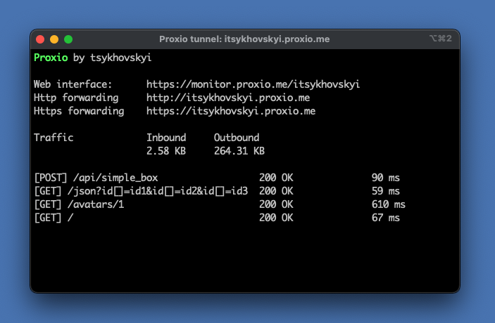

# Proxio

Make your localhost public

## How to use

Proxio is an SSH server just for remote port forwarding. When a user connects to Proxio, they get a public URL that
anybody can use to connect to their localhost server.

Basic use `ssh -R 80:localhost:3000 proxio.me` The -R option instructs your SSH client to request port forwarding from
the server and proxy requests to the specified host and port (usually localhost). A subdomain of proxio.me will be
assigned to forward HTTP traffic.

The host SSH key fingerprint is `SHA256:igPkNM9z0QvpyB3JF5KFPIppREZYNCDhwo+hZUiD4bQ`

## HTTP forwarding

HTTP tunnel opens only on 80 and 443 ports and has monitoring web utility to analyze your HTTP requests.

### Server subdomain assignment

If no particular subdomain was requested, proxio will suggest it based on SSH client username

`ssh -R 80:localhost:3000 proxio.me`

### Requesting subdomain

You can also request for a specific subdomain if it is available.

Provide full hostname for your desired proxy

`ssh -R john-doe.proxio.me:80:localhost:3000 proxio.me`

or authenticate with a username that matches your subdomain

`ssh -R 80:localhost:3000 john-doe@proxio.me`

## TCP forwarding

TCP can be opened on any free port from the range 2000-6999.

Type `ssh -R 0:localhost:3000 proxio.me` to allow server suggest free port for your tunnel.

If you want specific TCP port, then provide it in request `ssh -R 2345:localhost:3000 proxio.me`

