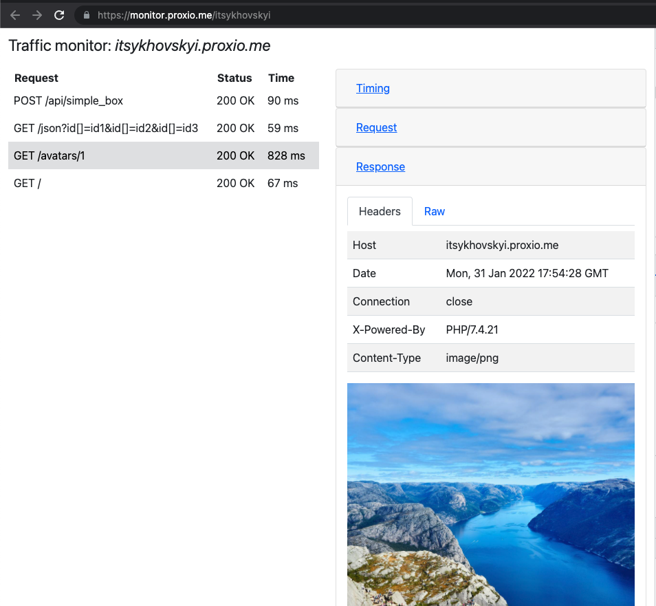

# MonitorApp

This project provides monitoring interface for proxio HTTP tunnels.

## Development server

For develop purposes set `MONITOR_APP_DEV_PORT=3000` in proxio server application.

Then run `npm run start` for a dev server.

Navigate to `http://monitor.localhost:3000`.
